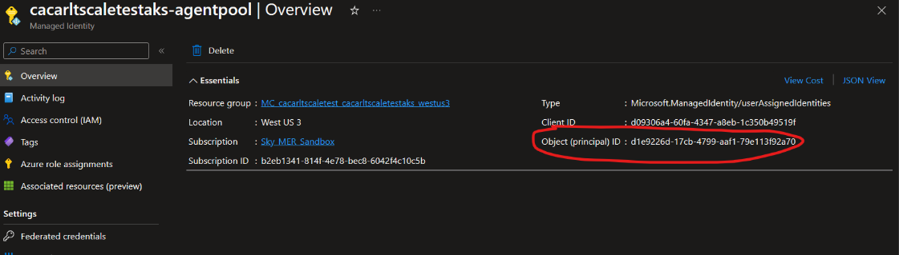
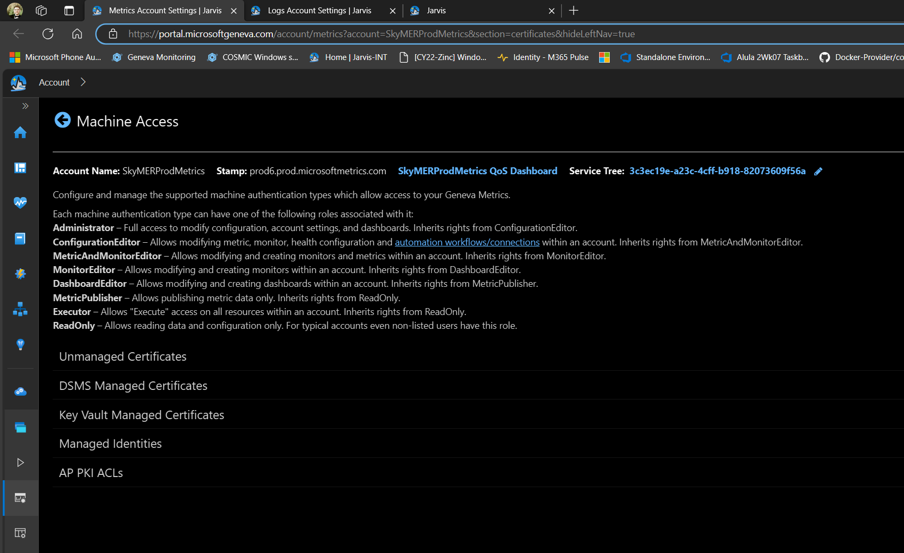
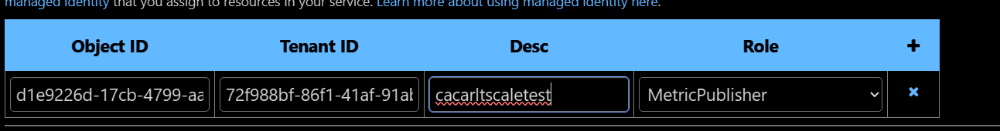
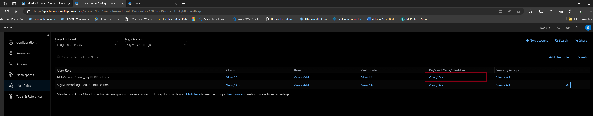
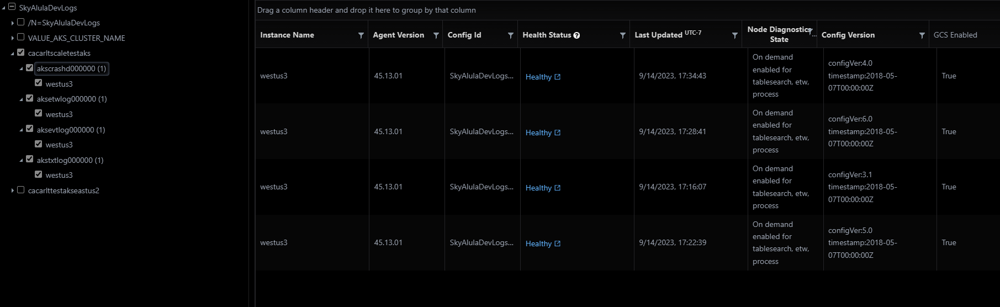
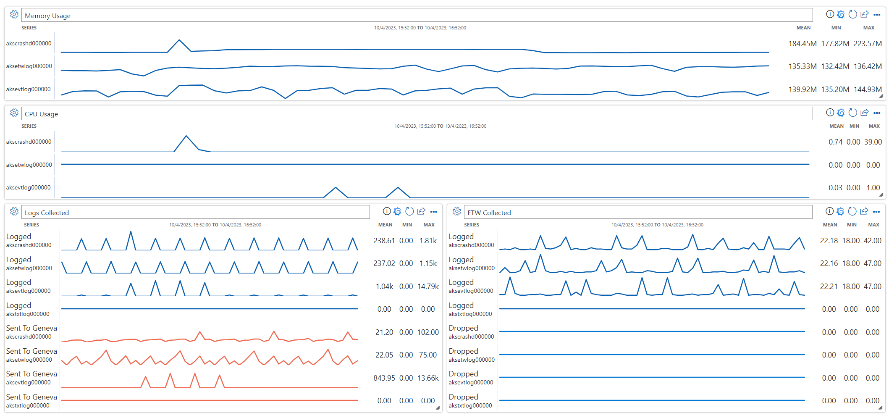
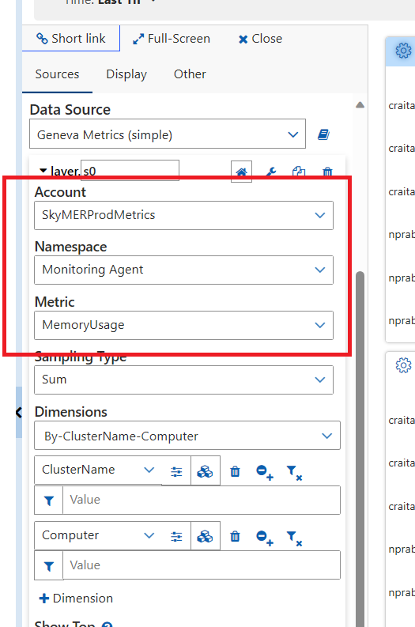
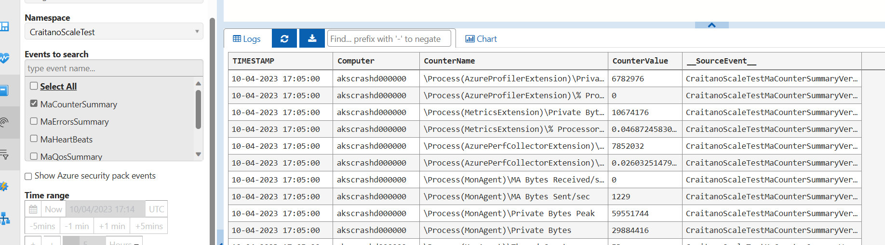
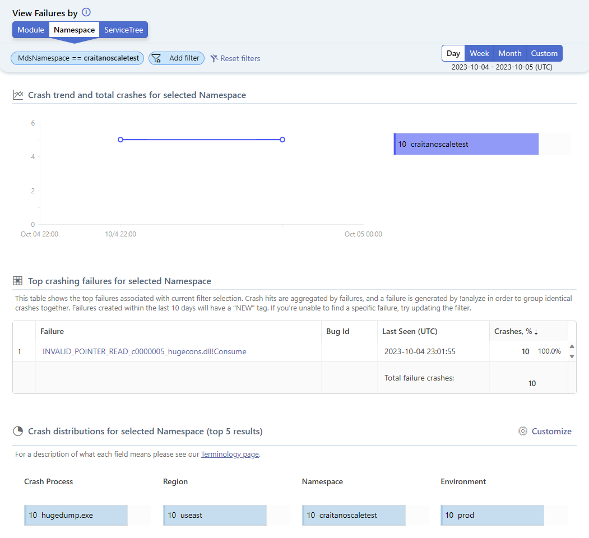
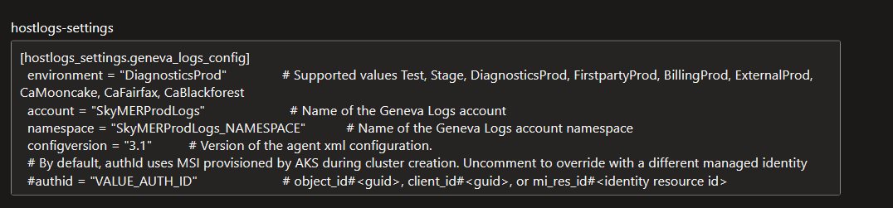

# Windows Host Logs Scale Test

## Prerequisites
- Access to an Azure Subscription
- A Diagnostics PROD Geneva Account where you have permissions to edit Geneva Log Configurations
- [Azure CLI](https://learn.microsoft.com/en-us/cli/azure/install-azure-cli)
- Latest sky-dev branch
- Run `.\Docker-Provider\scripts\build\windows\install-build-pre-requisites.ps1`
- [Install nuget.exe](https://learn.microsoft.com/en-us/nuget/consume-packages/install-use-packages-nuget-cli#prerequisites)
<br>GENEVA_METRIC_ACCOUNT

## 1. Deploy Scale Test Infrastructure 
The first thing we need to do is setup the infrastructure for our scale test. We will do this with `.\Docker-Provider\test\whl-scale-tests\deploy-infra.ps1`. This script will create a new resource group (Ex. [alias]scaletest). Within that resource group you will find an AKS Cluster, an Azure Container Registry and a Key Vault. Your cluster will have four nodepool one for each scale component (Crash Dumps, Text Logs, ETW, Event Logs), by default, configured with the most recent stable kubernetes version and each nodepool having one node each. 

### Using deploy-infra.ps1
```powershell
.\deploy-infra.ps1 `
    -SubscriptionId "<your-azure-subscription>" `
    -Location "<preferred-azure-region>" `
    -WindowsVMSize "<preferred-vm-size>" `
    -AKSAutoUpgradeChannel "<preferred-cluster-configuration>"
    -AKSVersion "<preferred-aks-version>" `
    -AKSWindowsNodeCount "<preferred-aks-windows-node-count>"
```

Here are some brief notes on the parameters:

- **SubscriptionId** - The Azure Subscription ID you want to use for WHL Scale Testing.
    
- **Location** - Your preferred Azure region for deploying resources.

- **WindowsVMSize** - **[Optional]** Default VM size is Standard_D2s_v3. Feel free to increase the size but do not go any lower than this.
    
- **AKSAutoUpgradeChannel** - **[Optional]** Choose between "none","node-image",  "patch", "rapid", "stable". By default we have it set to "none".

- **AKSVersion** - **[Optional]** We default to the version COSMIC is using as of writing this document. 

- **AKSWindowsNodeCount** - **[Optional]** Sets the number of nodes for each Windows Nodepool. By default it is set to one node per Windows nodepool.

Example:
```powershell
.\deploy-infra.ps1 `
    -SubscriptionId "b2eb1341-814f-4e78-bec8-6042f4c10c5b" `
    -Location "westus3"
```

<br>

## 2. Prepare Geneva XML Configuration

> [!NOTE]
>
> If you know you already have a Geneva Account with each of these already configured go ahead and take note of their config versions because will need it for the next section. You will still need to setup your AKS Cluster Object ID for both Geneva Metrics and Geneva Logs

In setting up the Windows Host Log Scale Test Suite you will need to make sure that you have four configurations that focus on each log type. 

To automatically configure the XML for your Geneva Account we will use `.\Docker-Provider\test\whl-scale-tests\prepare-geneva-xml.ps1.` This script will take the xml files in `.\Docker-Provider\test\whl-scale-tests\geneva-config-files` and configure each with your Geneva Account parameters.

### Using prepare-geneva-xml.ps1
```powershell
.\prepare-geneva-xml.ps1 `
    -GenevaAccountName "<your-geneva-account-name>" `
    -GenevaLogAccountNamespace "<your-geneva-log-account-namespace>" `
    -GenevaMetricAccountName "<your-geneva-metric-account-name>" `
    -AKSClusterMSIObjectId "<your-aks-cluster-msi-object-id>"
```
Here are some brief notes on the parameters:

- **GenevaAccountName** - Set this to the name of the Geneva Account you wish to use for scale testing WHL.
    
- **GenevaLogAccountNamespace** - Set this to the Geneva Logs Account Namespace you wish to use for scale testing WHL.
    
- **GenevaMetricAccountName** - Set this to the Geneva Metrics Account you wish to use for scale testing WHL.
    
- **AKSClusterMSIObjectId** - Set this to the MSI assigned to your AKS cluster. You can find this by going to the Azure Portal -> search for your MC_[resource_group]\_[cluster_name]_[region] -> find the [cluster_name]-nodepool -> Get the Object ID.



Example:
```powershell
.\prepare-geneva-xml.ps1 `
    -GenevaAccountName "SkyMERProdLogs" `
    -GenevaLogAccountNamespace "SkyAlulaDevLogs" `
    -GenevaMetricAccountName "SkyMERProdMetrics" `
    -AKSClusterMSIObjectId "d1e9226d-17cb-4799-aaf1-79e113f92a70"
```
<br>

Once you are done with the script it will open three tab for you in the following order: Geneva Metrics Machine Accesss, Geneva Logs User Roles and a page where you can upload your newly created XML files.

### Assign AKS Cluster Object ID to Geneva Metrics

1. Go to the newly opened Web Browser Window and select the first new tab:


2. Select "Managed Identities"

3. Setup a new row with your AKS Cluster Object ID, your Subscription's Tenant ID, describe the cluster attach to this item and provide the "MetricPublisher" Role. It should look similar to this

    

4. Click save towards the top of the page. 
<br>

### Assign AKS Cluster Object ID to Geneva Logs

1. Go next tab:

2. Go to User Role "<your_geneva_logs_account>_MaCommunication" -> "KeyVault Certs/Identities" and Click "View/Add"


1. Select "Managed Identities"

2. Setup a new entry with your AKS Cluster Object ID, your Subscription's Tenant ID, leave Resource ID blank, and your cluster name for the description. It should look similar to this
    

3. Click save toward the bottom of the form.
<br>

Now use the last tab to upload each XML file under `.\Docker-Provider\test\whl-scale-tests\geneva-config-files\`

## 3. Deploy Scale Test Suite 
After setting the your Geneva Account with the AKS Cluster and the four different XML configurations we can move forward to deploying the scale test suite. We will do this with `.\Docker-Provider\test\whl-scale-tests\deploy-scale-test-suite.ps1`. This script will deploy five namespaces, eight of which will be for each testing component, the other four will be for targeting WHL to collect the corresponding test component.

### Using deploy-infra.ps1
```powershell
.\deploy-scale-test-suite.ps1 `
    -SubscriptionId "<your-azure-subscription>" `
    -Location "<current-deployed-infra-region>"
    -GenevaAccountName "<your-geneva-account-name>" `
    -GenevaLogAccountNamespace "<your-geneva-log-account-namespace>" `
    -CrashDumpConfigVersion "<config-version-for-crash-dump-collection>" `
    -ETWConfigVersion "<config-version-for-etw-log-collection>" `
    -EventLogConfigVersion "<config-version-for-event-log-collection>" `
    -TextLogConfigVersion "<config-version-for-text-log-collection>"
```

Here are some brief notes on the parameters:

- **SubscriptionId** - The Azure Subscription ID you want to use for WHL Scale Testing.
    
- **Location** - Your preferred Azure region for deploying resources. Make sure it is the same one you used for `deploy-infra.ps1`

- **GenevaAccountName** - Set this to the name of the Geneva Account you wish to use for scale testing WHL.
    
- **GenevaLogAccountNamespace** - Set this to the Geneva Logs Account Namespace you wish to use for scale testing WHL.

- **CrashDumpConfigVersion** - Use the config version that you uploaded to handle Crash Dump Collection.
    
- **ETWConfigVersion** - Use the config version that you uploaded to handle ETW Log Collection.

- **EventLogConfigVersion** - Use the config version that you uploaded to handle Event Log Collection.

- **TextLogConfigVersion** - Use the config version that you uploaded to handle Text Log Collection.

Example:
```powershell
.\deploy-scale-test-suite.ps1 `
    -SubscriptionId "b2eb1341-814f-4e78-bec8-6042f4c10c5b" `
    -Location "westus3" `
    -GenevaAccountName "SkyMERProdLogs" `
    -GenevaLogAccountNamespace "SkyAlulaDevLogs" `
    -CrashDumpConfigVersion "3.1" `
    -ETWConfigVersion "6.0" `
    -EventLogConfigVersion "5.0" `
    -TextLogConfigVersion "4.0"
```
<br>

## 4. Validate WHL is Collecting Logs
1. Got to [aka.ms/jarvis/agentExplorer](https://portal.microsoftgeneva.com/diagnose/agentExplorer)
2. Put in your geneva info Ex. show imge of exmaple
3. Make sure after 15 mins that the agent is reporting healthy like so: Another image of a healthy agent
   
   
4. Now go to logs section -> navigate to one of the collect logs and make sure their is data there
5. Now go to metrics section -> naviagte to a Agent QoS and verify that data is working as expected


## 5. Generating logs for testing
Log generators can be deployed to create large amounts of logs for scale testing. Log generators will be deployed in separate daemonsets for Text Logs, ETWs, Event Logs and Crash Dumps
### Configure Log Generators
Log generators can be configured by editing the values in `log-generation-config.yaml`. Each generator has different configuration options.
#### Text Logs

`TODO: Fill out text log generator configuration`
| Option | Description |
| ------ | ----------- |
| | |

#### ETW
| Option | Description |
| ------ | ----------- |
| ETW_EVENTS_NUM | Number of ETW events to generate|

#### Event Logs
| Option | Description |
| ------ | ----------- |
| EVTLOGS_JOB_COUNT | Number of event log generation jobs to run in parallel
| EVTLOGS_LOG_COUNT | Number of event logs to generate per job
| EVTLOGS_DELAY | Time to wait between writing each event log

#### Crash Dumps

| Option | Description |
| ------ | ----------- |
| CRASHD_NUM_CRASHES | Number of crash dumps to generate |
| CRASHD_ALLOC_STRATEGY | Strategy to use for memory allocation. Options are: <ul> <li> va : allocate using VirtualAlloc </li><li> ha : allocate using HeapAlloc </li><li> sa : allocate on threads' stacks </li><ul> |
| CRASHD_ALLOC_TOTAL_SIZE | Total number of GB to allocate before crashing |
| CRASHD_ALLOC_PORTION_SIZE | Allocation portion size in KB |

### Deploy Log generators
```powershell
./deploy-log-generators.ps1
```
By default this will deploy all of the available log generators. If you only need to deploy a specific generator, use the flags -TextLogs, -ETW, -EventLogs or -CrashDumps to specify which generator to deploy.

### Optional - Redeploy log generators
It is possible to redeploy the log generators by re-running `./deploy-log-generators.ps1`. 
By default this will delete any existing log generator daemonsets, rebuild the docker image, and deploy new daemonsets. 

You can also use the `-ApplyConfigChanges` flag to apply the configuration changes in `log-generation-config.yaml` and restart the existing daemonsets without performing a full cleanup and image build.

Example: <br/>
Redeploy the Text Logs and Crash Dumps generators with new configuration
```powershell
./deploy-log-generators.ps1 -TextLogs -CrashDumps -ApplyConfigChanges
```
## 6. Taking Measurements of each component
Metrics will be automatically sent to your Geneva account.
To view a metrics summary you can create a [Geneva dashboard](https://portal.microsoftgeneva.com/dashboard/)


For the data source setting, set "Account" to your Geneva account and Namespace to "Monitoring Agent". From here you can see a variety of metrics such as CpuUsage, MemoryUsage and EventsLogged. For more info on the available metrics see [eng.ms/docs/products/geneva/collect/manage/agentmetrics](https://eng.ms/docs/products/geneva/collect/manage/agentmetrics#metrics)



If more precise numbers are needed, it's also possible to view metrics counter logs in [dgrep](https://portal.microsoftgeneva.com/logs/dgrep) under the MACounterSummary metric.



### Viewing Collected Logs
If you need to view the collected test logs:
* Event Logs , ETWs and Text Logs will show up in [dgrep](https://portal.microsoftgeneva.com/logs/dgrep)
* Crash Dumps will show up in [azure watson](https://portal.watson.azure.com). The easiest way to find your crash dumps is to filter by MdsNamespace (Geneva account namespace). Scale testing crash dumps will show the crash process as "hugedump.exe"


## 7. How to clean up scale test infra
To clean up all the resources you deployed we are going to use `.\Docker-Provider\test\whl-scale-tests\clean-infra.ps1`

### Using clean-infra.ps1
```powershell
.\clean-infra.ps1 `
    -SubscriptionId "<your-azure-subscription>" `
    -Location "<whl-resource-azure-region>" 
```

Here are some brief notes on the parameters:

- **SubscriptionId** - The Azure Subscription ID in use for WHL Scale Testing.
    
- **Location** - The region used to for deploy the infra.

Example:
```powershell
.\clean-infra.ps1 `
    -SubscriptionId "b2eb1341-814f-4e78-bec8-6042f4c10c5b" `
    -Location "westus3" `
```

# Troubleshooting

## After 30 mins or more and the Agent Hasn't appeared in Agent Explorer

### Cause 1:
The MSI used isnt configured properly. Make sure that the latest deployment of your clusters <clustername>-agentpool msi's Object ID is configured in Geneva Logs User Roles properly. Refer to Section 2.

## Cause 2:
The values used in the configmap isnt correct.

Go to your deployed aks cluster -> Go to Configurations -> choose the namespace that isnt working as expected and check the configmap. 

Example of a problem:


In this example the namespace isnt set correctly which will make the agent run healthy but it wont ever connect upstream properly.

If this looks good then it is time to dig deeper with the Agent Logs.

Use `kubectl exec -it <name_of_the_pod_not_working> the -n <namespace_that_contains_the_pod>-- powershell` 

Nav to .\opt\genevamonitoringagent\datadirectory\Configuration

Look for the latest MonAgentHost.*.log

In this file we want to look for a few things:

1. Look for the starting agent command and validate that it looks right with values you would expect

Ex. 'C:\C\7bb64a8ce0a1cff91c9489d224ed56dd78d46b9415a1acdafb670ebb72e665b1\opt\genevamonitoringagent\genevamonitoringagent\Monitoring\Agent\MonAgentManager.exe 
-serviceShutdown MonAgentShutdownEvent.9520 
-parent 9520 
-deploymentdir "C:\C\7bb64a8ce0a1cff91c9489d224ed56dd78d46b9415a1acdafb670ebb72e665b1\opt\genevamonitoringagent\genevamonitoringagent\Monitoring\Agent" 
-LocalPath "C:\C\7bb64a8ce0a1cff91c9489d224ed56dd78d46b9415a1acdafb670ebb72e665b1\opt\genevamonitoringagent\datadirectory" 
-connectionInfo "AuthMSIToken" 
"-serviceIdentity" "DiagnosticsProd#SkyMERProdLogs#SkyMERProdLogs_NAMESPACE#westus3" 
"-configVersion" "6.0" 
"-ManagedIdentity" 
"client_id#10e472c6-ff9e-4656-a878-dc9644d40eab" 
"-parentCpuRate" "25,6"
-LogPath "C:\C\7bb64a8ce0a1cff91c9489d224ed56dd78d46b9415a1acdafb670ebb72e665b1\opt\genevamonitoringagent\datadirectory\Configuration\MonAgentHost.73.log"'
   
1. Check if the agent is having failing in grabbing the config version


Example 1.1
Error (2023-09-14T19:02:04Z): GcsManager.dll - Call to download Configuration JSON blob from GCS failed; requestId=529b2797-37d1-4ff3-a9f9-88fd25a993c5; response={"LatestConfigVersionFound":null,"ErrorMessage":"There is no monitoring configuration found for the version given. Look at the LatestConfigVersionFound attributeto know the latest minor version available."}; AuthType=5; result=80050003


Example 1.2
Error (2023-09-14T19:02:04Z): GcsManager.dll - The asked for configuration version 6.0 is not deployed in your Geneva account SkyMERProdLogs and namespace SkyMERProdLogs_NAMESPACE in environment DiagnosticsProd. MA is configured to receive the latest version, 6.0, when this happens. This usage violates Azure safe deployment practices. See https://aka.ms/GenevaSafeConfigUpdate for more details.